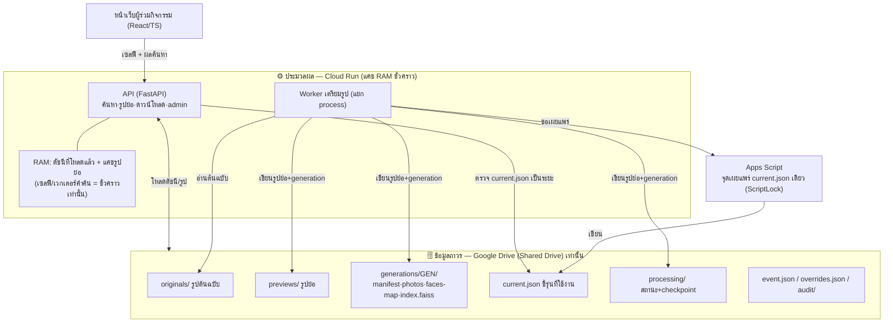

# PhotoSearch — ค้นหารูปงานอีเวนต์ด้วยเซลฟี

เว็บไซต์ให้ผู้ร่วมกิจกรรมค้นหารูปของตัวเองด้วยการถ่าย/เลือกรูปเซลฟีหนึ่งใบ
ออกแบบให้ใช้ง่ายบนมือถือ ค้นหาเร็ว และ **ทำงานต่อได้แม้การเตรียมรูปบางส่วนล้มเหลว**

> **ข้อสมมติหลักของแบบนี้ (ยืนยันกับผู้ใช้แล้ว):**
> - **Google Drive (Shared Drive) เป็นแหล่งข้อมูลถาวรของกิจกรรมเพียงแห่งเดียว** —
>   รูปต้นฉบับ รูปย่อ รายการรูป ดัชนีใบหน้า สถานะงาน รุ่นข้อมูล และ audit อยู่ใน Drive ทั้งหมด
> - บริการประมวลผล (Cloud Run) ใช้ **แคชชั่วคราวใน RAM** เท่านั้น ไม่มีฐานข้อมูล/ที่เก็บกิจกรรมถาวรภายนอก
> - เซลฟีและเวกเตอร์ของคำค้นอยู่ **ในหน่วยความจำระหว่างประมวลผลเท่านั้น ไม่บันทึกถาวร**
> - แพลตฟอร์ม (Cloud Run) ยังคงมี config/log/revision ของตัวเองนอก Drive อย่างหลีกเลี่ยงไม่ได้ —
>   ถือเป็น metadata โครงสร้างพื้นฐาน ไม่ใช่ข้อมูลกิจกรรม (ผู้ใช้ยอมรับข้อนี้)
> - โมเดล pretrained (InsightFace buffalo_l) ใช้เชิง **วิจัย/ไม่พาณิชย์** ตามที่ผู้ใช้ยืนยัน

## สถานะปัจจุบัน (พิสูจน์แล้วอะไรบ้าง)

| ส่วน | สถานะ | หลักฐาน |
|---|---|---|
| เส้นทางข้อมูลครบวงจร (Drive→index→selfie→match→preview→download) | ✅ รันได้จริง | 14 เทสต์ผ่าน + สกรีนช็อตหน้าเว็บจริง |
| ความถูกต้องของ pipeline (dedupe/pagination/สถานะ) | ✅ พิสูจน์ | `tests/` precision/recall = 1.0 บนข้อมูลจำลอง |
| หน้าเว็บภาษาไทย (มือถือ) + Admin console | ✅ build + รันจริง | `docs/screenshots/` |
| เวลาเทียบเวกเตอร์ใน RAM | ✅ วัดจริง (เครื่องนี้) | p95 ~1.9ms@1,800 / ~3.7ms@5,000 (dim=512) |
| โหลด API (mock embedder, 1 instance) | ✅ วัดจริง | 50 users ทยอย: search p95 ~400ms, 0 fail |
| **InsightFace จริง (buffalo_l) บนภาพจริงชุดเล็ก** | ✅ พิสูจน์แล้ว | verification acc 1.0 / search P·R 1.0; cosine same 0.76 vs diff 0.01 |
| ความแม่นยำบน **ภาพงานจริง** (เบลอ/หันข้าง/ภาพกลุ่ม) | ⛔ ยังไม่วัด | ต้องมีภาพงานจริง — ดู `docs/status.md` |
| **Google Drive backend จริง** | ⛔ รอ credential | มี `scripts/drive_selftest.py` พร้อมรัน — ดู `docs/status.md` |
| Deploy Cloud Run จริง | ⛔ ยังไม่ทำ (รอคำสั่ง) | ขั้นตอนใน `docs/deploy.md` |

รายละเอียด "อะไรพิสูจน์แล้ว/ยังไม่" อยู่ที่ **[docs/status.md](docs/status.md)**

## สถาปัตยกรรมโดยย่อ



- **เส้นทางเตรียมรูป:** อัปโหลดเข้า Drive → worker ประมวลผลทุกใบหน้า → เขียนรูปย่อ+generation ใหม่ →
  ตรวจ checksum → เผยแพร่ผ่าน Apps Script → API โหลดแล้วสลับใช้ (ระหว่างนั้นยังค้นรุ่นเดิมได้)
- **เส้นทางค้นหา:** เปิดกิจกรรม → ส่งเซลฟี → API แปลงเป็นเวกเตอร์ → ค้นดัชนีในกิจกรรมนั้นจาก RAM →
  ส่งรายการรูปที่ผ่านเกณฑ์ → หน้าเว็บโหลดรูปย่อ → ดึงต้นฉบับเมื่อกดดาวน์โหลด

รายละเอียดเต็ม: **[docs/architecture.md](docs/architecture.md)**

## เริ่มต้นเร็ว (ทดสอบในเครื่อง ไม่ต้องมี Drive/credential)

```bash
# 1) backend
cd server
pip install -r requirements.txt
export LOCAL_ROOT=./_data EMBEDDER=mock STORAGE_BACKEND=local \
       ADMIN_TOKEN=dev MEDIA_TOKEN_SECRET=dev

# 2) สร้างข้อมูลจำลอง (SYNTHETIC — ไม่ใช่ใบหน้าจริง) แล้วเตรียมรูป
python scripts/make_fixtures.py --root ./_data --event demo --photos 60 --identities 10
python -m photosearch.cli init-event --event demo --originals events/demo/originals
python -m photosearch.cli prepare --event demo

# 3) ค้นหาจาก CLI
python -m photosearch.cli search --event demo \
  --selfie _data/_fixtures/demo/selfies/identity_3.jpg

# 4) หน้าเว็บ + API origin เดียวกัน
cd ../web && npm install && npm run build && cd ../server
export WEB_DIST=../web/dist
uvicorn photosearch.api.app:app --port 8000
#  เปิด http://localhost:8000/e/demo
```

รันเทสต์: `cd server && python -m pytest`
รันด้วย Docker: `docker compose up --build` (local + mock)

## โครงสร้าง repo

```
server/         backend Python (API + worker + core)
  photosearch/  แพ็กเกจหลัก: storage, embedder, faceindex, services, api, worker
  scripts/      make_fixtures, bench, screenshots
  tests/        pytest (E2E + accuracy บนข้อมูลจำลอง)
web/            หน้าเว็บ React + TypeScript + Vite (ภาษาไทย)
apps-script/    ตัวเผยแพร่ current.json + จัดการกิจกรรม (ScriptLock)
tests/load/     k6 + Locust
docs/           สถาปัตยกรรม ติดตั้ง Drive การใช้งาน ทดสอบ ประสิทธิภาพ ค่าใช้จ่าย โมเดล สถานะ
```

## เอกสาร
- [สถาปัตยกรรม](docs/architecture.md) · [ตั้งค่า Drive](docs/drive-setup.md) · [ติดตั้ง](docs/install.md)
- [การใช้งาน (เปิด/ปิดงาน นำเข้ารูป แก้ปัญหา)](docs/operations.md) · [ทดสอบ](docs/testing.md)
- [แผนพิสูจน์ประสิทธิภาพ](docs/performance-plan.md) · [ค่าใช้จ่าย](docs/cost.md) · [โมเดลและสิทธิ์](docs/models.md)
- [Deploy](docs/deploy.md) · [สถานะ/ข้อจำกัด](docs/status.md)
