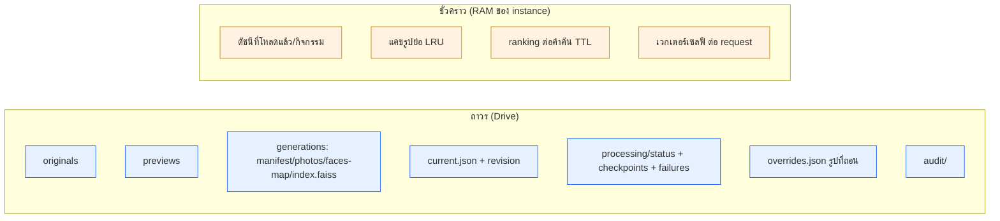
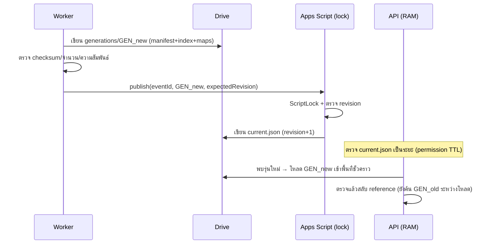

# สถาปัตยกรรม

## หลักการออกแบบ
1. **Google Drive = แหล่งข้อมูลถาวรของกิจกรรมเพียงแห่งเดียว** ทุกอย่างที่ต้องคงอยู่ (ต้นฉบับ รูปย่อ
   รายการรูป ดัชนี สถานะ รุ่นข้อมูล audit) อยู่ใน Drive — บริการประมวลผลกู้สภาพจาก Drive ได้ล้วน ๆ
2. **บริการประมวลผลไร้สถานะถาวร** Cloud Run เก็บเฉพาะแคชใน RAM; รีสตาร์ทแล้วโหลดใหม่จาก Drive ได้
3. **แยกข้อมูลกิจกรรม ออกจาก ไฟล์โปรแกรม/การตั้งค่า deployment/metadata แพลตฟอร์ม**
   - ข้อมูลกิจกรรม → Drive
   - โค้ด/Dockerfile/ตัวแปรแวดล้อม → repo + ตัวจัดการ deploy
   - config/log/revision ของ Cloud Run เอง → คงอยู่ในแพลตฟอร์ม (เลี่ยงไม่ได้ ผู้ใช้ยอมรับ)
4. **เซลฟีและเวกเตอร์คำค้น = ชั่วคราว** อยู่ใน RAM ระหว่าง request เท่านั้น ไม่เขียนลง log/ดิสก์/Drive

## ข้อมูลถาวร vs ข้อมูลชั่วคราว

- **ห้าม**: ฐานข้อมูล/ที่เก็บกิจกรรมถาวรภายนอก (PostgreSQL, Supabase, Firebase, S3/R2/GCS, Redis ถาวร)
- **ห้าม**: ไฟล์ JSON ก้อนเดียวรวมทุกกิจกรรม, Google Sheets เป็นตารางเวกเตอร์อ่านทีละแถว

## ส่วนประกอบ

| ส่วน | เทคโนโลยี | ทำไม |
|---|---|---|
| หน้าเว็บ | React + TS + Vite | มือถือ, เรียก API ตรง, host origin เดียวกับ API ได้ |
| API | FastAPI | async, schema ชัด, เสิร์ฟรูป+ค้นหาโดยไม่ผ่าน Apps Script |
| โมเดลใบหน้า | InsightFace (ONNX) ผ่าน adapter | face recognition จริง (ไม่ใช่แค่ตรวจจับใบหน้า) |
| ดัชนี | FAISS `IndexFlatIP` ใน RAM แยกกิจกรรม | exact search, ใช้ซ้ำระหว่างคำค้น (มี numpy fallback) |
| worker | Python แยก process | ไม่แย่งทรัพยากร API ตอนค้นหา |
| เผยแพร่รุ่น | Apps Script | จุด commit เดียว + ScriptLock |
| เก็บถาวร | Google Drive | ตามข้อกำหนด |
| รันบริการ | Cloud Run | คุม min/max instance, concurrency, แคช RAM |

**ทำไมไม่ใช้ Apps Script เป็นดัชนีหลัก/รับค้นหา:** Apps Script มีเวลารันต่อ execution จำกัด และ
`CacheService` จำกัด 100KB/key อาจถูกนำออกก่อนหมดอายุ — จึงเหมาะเป็น "ตัวประสานงาน" เท่านั้น
([quotas](https://developers.google.com/apps-script/guides/services/quotas),
[CacheService](https://developers.google.com/apps-script/reference/cache/cache))

**ข้อจำกัด Cloud Run ที่ออกแบบเผื่อ:** filesystem เป็น in-memory และหายเมื่อ instance หยุด
→ กำหนดขนาดแคช/พื้นที่ชั่วคราวชัดเจน, ทุกอย่างกู้จาก Drive ได้
([container contract](https://docs.cloud.google.com/run/docs/container-contract))

## การเผยแพร่รุ่นข้อมูลโดยไม่ทำให้ค้นหาสะดุด

- สร้าง generation ใหม่แยกจากรุ่นใช้งาน → ตรวจครบ → publish จุดเดียว
- API เผื่อ RAM สองรุ่นชั่วคราวระหว่างสลับ
- การเขียนหลายไฟล์ใน Drive **ไม่ใช่ transaction** — จึงมี current.json เป็น commit เดียว
- worker อาจถูกเรียกซ้ำ → ใช้ checkpoint (jobKey) idempotent; ผู้ถือสิทธิ์เก่าห้ามเผยแพร่ทับรุ่นใหม่
  (ตรวจ expectedRevision ที่จุดประสานงานเดียว)

## การถอนรูป/ปิดกิจกรรม แยกจากการสร้างดัชนี
`overrides.json` เก็บรายการ photoId ที่ถอน — API กรองตอนค้นหา/เสิร์ฟรูป (permission TTL สั้น)
จึงถอนรูปได้ **โดยไม่ต้อง reindex** และการย้อนรุ่นดัชนีก็ไม่ทำให้รูปที่ถอนกลับมาเข้าถึงได้

## ความปลอดภัยของลิงก์รูป
- ไม่เปิดโฟลเดอร์ทั้งงานเป็น public; API ตรวจสิทธิ์กิจกรรม+รูปก่อนอ่านทุกครั้ง
- ลิงก์รูปใช้ **token ของแอปเรา (HMAC)** ผูก eventId+photoId+kind+อายุ — ไม่ใช่ Drive signed URL
- ไม่เก็บ `thumbnailLink` ของ Drive เป็น URL ถาวร (มีอายุ/ข้อจำกัด)
- credential ของ Google ไม่ถูกส่งไปหน้าเว็บหรือฝังใน token
